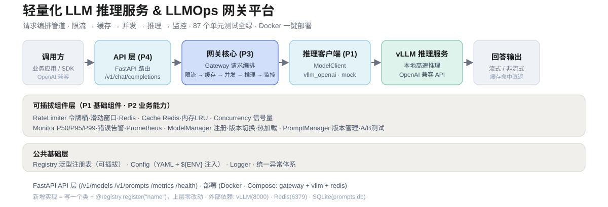
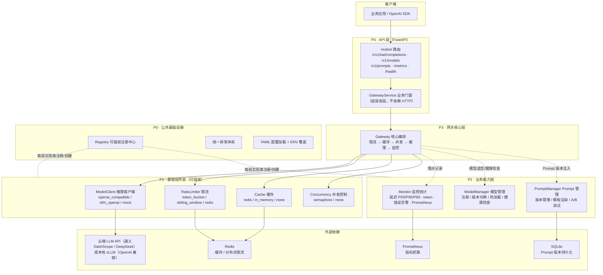
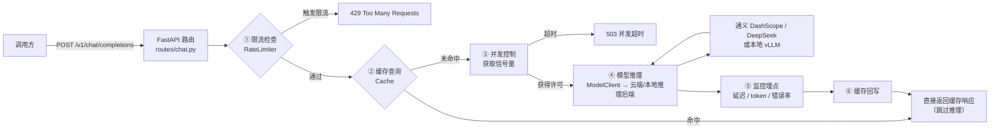

# 轻量化 LLM 推理服务 & LLMOps 网关平台

> OpenAI 兼容 API 网关平台：代理云端 LLM API（通义 DashScope / DeepSeek）或本地 vLLM，不实现底层推理；负责流量管控、缓存、监控统计、Prompt 版本管理与 A/B 测试。

## 架构概览



### 整体分层架构



### 单次请求处理链路



### 核心特性

- **统一推理接口**：OpenAI 兼容 API，支持云端 API（通义 / DeepSeek）/ 本地 vLLM / Mock 等多种后端
- **请求限流**：令牌桶 / 滑动窗口 / Redis 分布式限流
- **响应缓存**：基于 prompt hash 的请求缓存，支持 Redis / 内存 LRU
- **并发控制**：信号量控制最大并发请求数
- **监控统计**：调用日志、耗时（P50/P95/P99）、token 统计、错误率告警、Prometheus 导出
- **模型管理**：模型注册、版本切换、热加载协调
- **Prompt 版本管理**：Prompt CRUD、版本管理、模板渲染、SQLite 持久化
- **A/B 测试**：按 user_id hash 稳定分流、流量百分比分配、指标对比

## 项目结构

```
llm_gateway/
├── config/                    # 配置文件
│   ├── settings.yaml          # 全局配置
│   └── logging.yaml           # 日志配置
├── src/
│   ├── common/                # P0 公共基础设施
│   │   ├── constants.py       # 常量
│   │   ├── exceptions.py      # 统一异常层级
│   │   └── registry.py        # 可插拔注册中心
│   ├── utils/                 # 工具模块
│   │   ├── config_loader.py   # YAML 配置加载（支持 ${ENV} 占位符）
│   │   └── logger.py          # 日志工具
│   ├── model_client/          # P1 推理客户端层
│   │   ├── base.py            # ModelClient ABC
│   │   ├── vllm_client.py     # OpenAI 兼容客户端（云端 API / 本地 vLLM）
│   │   ├── mock_client.py     # Mock 客户端（测试用）
│   │   └── registry.py
│   ├── rate_limiter/          # P1 限流层
│   │   ├── base.py
│   │   ├── token_bucket.py    # 令牌桶
│   │   ├── sliding_window.py  # 滑动窗口
│   │   ├── redis_limiter.py   # Redis 分布式限流
│   │   ├── none_limiter.py    # 无限流
│   │   └── registry.py
│   ├── cache/                 # P1 缓存层
│   │   ├── base.py
│   │   ├── redis_cache.py     # Redis 缓存
│   │   ├── in_memory_cache.py # 内存 LRU 缓存
│   │   ├── none_cache.py      # 无缓存
│   │   └── registry.py
│   ├── concurrency/           # P1 并发控制层
│   │   ├── base.py
│   │   ├── semaphore_controller.py  # 信号量控制
│   │   ├── none_controller.py
│   │   └── registry.py
│   ├── monitor/               # P2 监控统计层
│   │   ├── base.py
│   │   ├── file_metrics.py    # 内存+文件聚合统计
│   │   ├── prometheus_exporter.py  # Prometheus 指标导出
│   │   ├── none_monitor.py
│   │   └── registry.py
│   ├── model_manager/         # P2 模型管理层
│   │   ├── base.py
│   │   ├── local_manager.py   # 本地配置管理
│   │   ├── vllm_manager.py    # vLLM API 协调管理
│   │   └── registry.py
│   ├── prompt_manager/        # P2 Prompt 管理层
│   │   ├── base.py
│   │   ├── sqlite_store.py    # SQLite 持久化
│   │   ├── memory_store.py    # 内存存储
│   │   ├── ab_testing.py      # A/B 测试管理器
│   │   └── registry.py
│   ├── gateway/               # P3 网关核心编排
│   │   └── gateway.py         # Gateway 核心类
│   └── api/                   # P4 API 层
│       ├── main.py            # FastAPI 应用工厂
│       ├── service.py         # GatewayService 业务门面
│       ├── schemas.py         # Pydantic 请求/响应模型
│       ├── dependencies.py    # 依赖注入
│       └── routes/
│           ├── chat.py        # /v1/chat/completions
│           ├── models.py      # /v1/models 模型管理
│           ├── prompts.py     # /v1/prompts Prompt 管理 + A/B 测试
│           ├── metrics.py     # /metrics 监控指标
│           └── system.py      # /health, /system/info
├── tests/                     # 单元测试
├── examples/                  # 示例脚本
├── docs/                      # 文档
├── Dockerfile
├── docker-compose.yml
├── requirements.txt
└── README.md
```

## 快速开始

### 1. 安装依赖

```bash
pip install -r requirements.txt
```

### 2. 启动服务（使用 Mock 客户端，无需任何推理后端）

```bash
# 默认使用 mock provider，无需真实推理服务
uvicorn src.api.main:app --host 0.0.0.0 --port 9000
```

### 3. 调用 API

```bash
# 健康检查
curl http://localhost:9000/health

# 聊天补全（非流式）
curl -X POST http://localhost:9000/v1/chat/completions \
  -H "Content-Type: application/json" \
  -d '{
    "model": "mock-model",
    "messages": [
      {"role": "system", "content": "你是一个 helpful 的助手。"},
      {"role": "user", "content": "你好，请介绍一下 LLM Gateway。"}
    ],
    "temperature": 0.7,
    "max_tokens": 512
  }'

# 聊天补全（流式）
curl -X POST http://localhost:9000/v1/chat/completions \
  -H "Content-Type: application/json" \
  -d '{
    "model": "mock-model",
    "messages": [{"role": "user", "content": "写一首短诗"}],
    "stream": true
  }'

# 系统信息
curl http://localhost:9000/system/info

# 监控指标
curl http://localhost:9000/metrics/summary
```

### 4. 运行示例

```bash
# 基础使用示例（直接使用 Gateway 核心类）
python examples/basic_usage.py

# API 客户端示例（需先启动服务）
python examples/api_client_demo.py
```

### 5. 运行测试

```bash
pytest tests/ -v
```

## 配置说明

配置文件位于 `config/settings.yaml`，支持以下配置段：

| 配置段 | 说明 | 可选 provider |
|--------|------|--------------|
| `model` | 推理客户端 | `openai_compatible`（云端 API）/ `vllm_openai` / `mock` |
| `rate_limit` | 限流 | `token_bucket` / `sliding_window` / `redis` / `none` |
| `cache` | 缓存 | `redis` / `in_memory` / `none` |
| `concurrency` | 并发控制 | `semaphore` / `none` |
| `monitor` | 监控统计 | `file_metrics` / `prometheus` / `none` |
| `model_manager` | 模型管理 | `local` / `vllm` |
| `prompt_manager` | Prompt 管理 | `sqlite` / `memory` |

### 环境变量覆盖

所有配置项均可通过环境变量覆盖，格式为 `GATEWAY_` + 配置路径（双下划线分隔层级）：

```bash
# 代理云端 LLM API（推荐，无需 GPU）
export GATEWAY_MODEL__PROVIDER=openai_compatible
export GATEWAY_MODEL__BASE_URL=https://dashscope.aliyuncs.com/compatible-mode/v1
export GATEWAY_MODEL__API_KEY=sk-your-key
export GATEWAY_MODEL__DEFAULT_MODEL=qwen3-max

# 启用 Redis 缓存
export GATEWAY_CACHE__PROVIDER=redis
export GATEWAY_REDIS_URL=redis://localhost:6379/0

# 调整限流
export GATEWAY_RATE_LIMIT__REQUESTS_PER_SECOND=50
export GATEWAY_RATE_LIMIT__BURST_SIZE=100
```

## Docker Compose 一键部署（推荐）

无需 GPU，代理云端 LLM API（通义 DashScope / DeepSeek），仅需 gateway + redis 两个轻量容器：

```bash
# 1. 配置云端 API Key（DeepSeek / 通义 DashScope，OpenAI 兼容）
cp .env.example .env
# 编辑 .env 填入真实 GATEWAY_MODEL_API_KEY

# 2. 构建并启动
docker compose up -d --build

# 3. 验证
curl http://localhost:8003/health
# 浏览器打开 Swagger 面板（可在线调试 /chat、/models、/metrics）：
# http://localhost:8003/docs
```

这会启动：
- `gateway`: LLM 网关服务（宿主机端口 8003 → 容器 9000），默认代理通义 DashScope（qwen3-max）
- `redis`: Redis 缓存 + 分布式限流（端口 6379）

切换后端只需改环境变量（或 `config/settings.yaml`）：

| 后端 | `GATEWAY_MODEL_PROVIDER` | `GATEWAY_MODEL_BASE_URL` |
|------|------------------------|--------------------------|
| 通义 DashScope | `openai_compatible` | `https://dashscope.aliyuncs.com/compatible-mode/v1` |
| DeepSeek | `openai_compatible` | `https://api.deepseek.com/v1` |
| 本地 vLLM（需 GPU） | `vllm_openai` | `http://localhost:8000/v1` |

## 连接本地 vLLM 服务（可选，需 GPU）

### 1. 启动 vLLM 服务

```bash
# 使用 vLLM 启动 OpenAI 兼容 API 服务
python -m vllm.entrypoints.openai.api_server \
  --model Qwen/Qwen2.5-7B-Instruct \
  --host 0.0.0.0 \
  --port 8000
```

### 2. 配置 Gateway 连接 vLLM

```bash
export GATEWAY_MODEL__PROVIDER=vllm_openai
export GATEWAY_MODEL__BASE_URL=http://localhost:8000/v1
export GATEWAY_MODEL__DEFAULT_MODEL=Qwen/Qwen2.5-7B-Instruct
```

## 在线演示

无需安装即可在线体验网关核心能力（真实云端 LLM 转发、模型管理、限流缓存、监控统计）：

[**▶ 打开在线演示**](https://your-gateway.example.com/docs) · 服务器托管 · Swagger 网关控制台

支持：直接在线调 `/chat`（真实转发通义 / DeepSeek）、`/models` 模型管理与切换、`/metrics` 延迟 / token / 错误率监控、Redis 限流与缓存开箱即用。

## API 文档

启动服务后访问 Swagger 文档：
- Docker Compose 部署：`http://localhost:8003/docs`
- 本地 uvicorn：`http://localhost:9000/docs`

### 主要端点

| 方法 | 路径 | 说明 |
|------|------|------|
| POST | `/v1/chat/completions` | 聊天补全（OpenAI 兼容，支持流式） |
| GET | `/v1/models` | 列出所有模型 |
| GET | `/v1/models/{name}` | 获取模型详情 |
| POST | `/v1/models/{name}/load` | 加载模型 |
| POST | `/v1/models/{name}/unload` | 卸载模型 |
| POST | `/v1/models/{name}/switch` | 切换激活模型 |
| POST | `/v1/prompts` | 创建 Prompt 模板 |
| GET | `/v1/prompts` | 列出 Prompt 模板 |
| GET | `/v1/prompts/{name}` | 获取 Prompt 详情 |
| POST | `/v1/prompts/{name}/versions` | 创建新版本 |
| POST | `/v1/prompts/{name}/render` | 渲染 Prompt |
| POST | `/v1/prompts/ab-tests` | 创建 A/B 测试 |
| GET | `/v1/prompts/ab-tests` | 列出 A/B 测试 |
| GET | `/v1/prompts/ab-tests/{id}/results` | 获取 A/B 测试结果 |
| GET | `/metrics/summary` | 获取监控指标汇总 |
| GET | `/metrics/requests` | 获取最近请求记录 |
| GET | `/metrics/prometheus` | Prometheus 指标导出 |
| GET | `/health` | 健康检查 |
| GET | `/system/info` | 系统信息 |

## 设计理念

### 可插拔架构

每个业务层都基于 `Registry` 注册中心实现可插拔：
- 每层定义 `base.py` 抽象接口
- 多种实现类通过 `@registry.register("name")` 注册
- 上层通过配置中的 `provider` 字段选择实现
- 新增实现只需注册新类，无需修改上层代码

### 配置驱动

- YAML 配置文件 + `${ENV}` 环境变量占位符
- 环境变量路径覆盖（`GATEWAY_MODEL__MODEL=x`）
- 所有组件通过配置组装，无需修改代码

### 分层设计

- **P0 公共层**：常量、异常、注册中心
- **P1 基础组件层**：推理客户端、限流、缓存、并发控制
- **P2 业务能力层**：监控统计、模型管理、Prompt 管理
- **P3 网关核心层**：请求编排（限流→缓存→并发→推理→监控）
- **P4 API 层**：FastAPI 路由、请求/响应模型

## 许可证

MIT License
